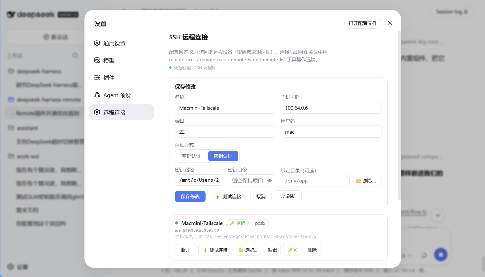

<h1 align="center">DeepSeek Harness Remote SSH</h1>

  <strong>Give your AI coding agent a secure SSH bridge to any machine.</strong> 
  Run commands, inspect projects, and read or write remote files from DeepSeek Harness—without installing an agent on the target.

  
  
  
  
  

  English · <a href="README.zh.md">简体中文</a> ·
  <a href="#quick-start">Quick start</a> ·
  <a href="#model-tools">Model tools</a> ·
  <a href="#security-model">Security</a>

  

## What is DeepSeek Harness Remote SSH?

DeepSeek Harness Remote SSH is an open-source **SSH remote development plugin for [DeepSeek Harness](https://github.com/deepseek-ai/DeepSeek-Harness)**. It adds seven native AI tools—`remote_connect`, `remote_exec`, `remote_read`, `remote_write`, and more—plus a polished Web settings experience for managing Linux, macOS, WSL, and Windows SSH targets.

Your model stays inside DeepSeek Harness. Your source code, build environment, GPU server, homelab, cloud VM, or edge device can live anywhere reachable over SSH.

> One plugin, one familiar workflow: connect a profile, then ask the agent to investigate, edit, build, test, or operate the remote machine.

## Why use it?

| Capability | What it gives you |
| --- | --- |
| **AI-native SSH tools** | The model can connect, execute commands, inspect status, and work with UTF-8 files and directories through structured tools. |
| **Zero remote installation** | The target only needs an SSH server and a login account—no daemon, runtime, or proprietary agent. |
| **First-class Web UI** | Create, test, edit, connect, browse, and remove profiles without hand-editing configuration files. |
| **Password or private key** | Use password authentication or an explicit private-key path, including encrypted keys and `~` expansion. |
| **Linux and Windows aware** | Remote platform detection gives the model the right POSIX or `cmd.exe` command context. |
| **Designed to fail safely** | Host-key pinning, bounded reconnects, classified errors, same-origin API protection, and no secret echo to the browser. |
| **Bilingual experience** | The settings UI follows the DeepSeek Harness language in English or Simplified Chinese. |

## Quick start

### Requirements

- Node.js 18 or newer
- [DeepSeek Harness](https://github.com/deepseek-ai/DeepSeek-Harness) and its `dsh` CLI
- A reachable SSH server with password or private-key authentication

### 1. Install the plugin

~~~sh
dsh plugin --profile web add @dsh-remote/remote-ssh
dsh --profile web
~~~

Using DeepSeek Harness through `npx`? Prefix both commands with `npx @deepseek-ai/dsh`.

### 2. Add a remote connection

Open **Settings → Remote Connections**, enter the host, port, user, and authentication method, then select **Test connection** before saving. You can optionally bind a frequently used directory with the built-in SFTP browser.

### 3. Ask the agent to work remotely

Try prompts such as:

> Connect to my staging profile, inspect the repository in `/srv/app`, run its test suite, and explain any failures.

> Read the latest nginx error log on my server and summarize the likely root cause. Do not change anything.

> On my Windows build machine, list the project directory and run the existing build command.

The plugin contributes its own tool guidance to the system prompt, so the model knows how to discover profiles and call the `remote_*` tool family.

## Model tools

| Tool | Purpose |
| --- | --- |
| `remote_status` | List saved profiles, connection state, detected platform, and the most recent classified error. |
| `remote_connect` | Connect with a saved profile or one-off host credentials. |
| `remote_disconnect` | Close a profile's live SSH connection. |
| `remote_exec` | Execute a remote command with stdout, stderr, exit status, and a configurable timeout up to 10 minutes. |
| `remote_read` | Read a UTF-8 text file over SFTP. |
| `remote_write` | Write complete UTF-8 text content over SFTP. |
| `remote_list` | List a remote directory with type, size, and modification time; directories are returned first. |

The settings page and model tools share the same connection manager:

~~~text
DeepSeek Harness session / Web UI
                │
         remote_* tool or RPC
                │
       RemoteManager + profiles
                │
       SSH commands + SFTP files
                │
     Linux · macOS · WSL · Windows
~~~

## Remote directory browser

Select **Browse…** beside a profile or bound-directory field to navigate the target through SFTP. The browser provides breadcrumbs, parent and home navigation, directory-first sorting, and keyboard support. A selected path can also be copied as a `remote://user@host/path` reference for conversation context.

## Pick a remote directory when adding a workspace

The plugin also occupies the **add-workspace** directory flow (the workspace picker's *Select Workspace Directory* dialog). The dialog keeps its original local browsing experience and gains a remote side:

- a floating **pick a directory on a remote machine…** chip switches to the remote tab;
- the remote tab lists every configured machine (status dot, address, current binding); selecting one connects on demand and browses its directories over SFTP;
- confirming a directory binds it as the session's **remote working context** for that machine: the `remote_*` tools resolve relative paths against it, `remote_exec` runs there by default, and the system prompt tells the model which remote directory is the primary working directory (most recent binding first).

Uninstalling the plugin restores the original local-only dialog.

> Boundary note: DSH workspaces themselves are local (`createWorkspace` resolves the path through the host's own filesystem), so a remote pick becomes the remote working context above rather than a DSH workspace entry. A `remote://` *workspace* proper requires the upstream `ctx.fs`/`ctx.subprocess` provider seam planned in `docs/remote-development-design.md`.

## Security model

Remote access is powerful, so the security boundary is explicit:

- **Trust on first use (TOFU):** the first successful handshake stores the server's OpenSSH-style SHA256 host fingerprint. Later mismatches fail closed and show both fingerprints. For sensitive systems, verify the first fingerprint through a separate trusted channel.
- **Protected secrets:** standard DeepSeek Harness compositions store passwords and key passphrases through `ctx.credentials`; the profile file keeps references only. Minimal compositions fall back to `~/.dsh/remote/profiles.json` with mode `0600`.
- **No secret echo:** API responses never include passwords or passphrases. Leaving a secret blank while editing preserves the stored value.
- **Same-origin browser bridge:** `/dsh-remote/api/*` rejects cross-origin requests and caps request bodies at 1 MiB.
- **Explicit keys only:** private-key authentication requires a chosen key path. The plugin does not silently try every key in `~/.ssh`.
- **Least privilege still matters:** commands run with the SSH account's permissions. A bound directory is a convenience, not an operating-system sandbox; use a dedicated account, container, or VM for stronger isolation.

## Connection behavior

- Keepalives detect dead sessions, and the next operation can reconnect with the saved profile.
- Reconnect attempts are bounded to three per profile in a 60-second window.
- Authentication, key-file, DNS, timeout, refused, unreachable, reset, and host-key errors are classified into concise English and Chinese messages.
- Command execution defaults to a 30-second timeout and is capped at 10 minutes.
- Connections are reused across command and SFTP operations, then removed from the live table when closed.

## Windows and private networks

Windows targets need [OpenSSH Server](https://learn.microsoft.com/windows-server/administration/openssh/openssh_install_firstuse) enabled and port 22 allowed through the firewall. A native Windows SSH shell normally uses `cmd.exe`; a target that lands in WSL is detected as POSIX.

The host can be a DNS name, LAN address, public IP, VPN address, or a private overlay such as Tailscale, as long as it is reachable from the machine running DeepSeek Harness.

## Local development

Start a disposable SSH target:

~~~sh
docker run -d --name dsh-sshd-test -p 2222:2222 \
  -e PUID=1000 -e PGID=1000 -e TZ=UTC -e SUDO_ACCESS=true \
  -e USER_NAME=dev -e USER_PASSWORD=test1234 -e PASSWORD_ACCESS=true \
  linuxserver/openssh-server

npm ci
npm test
npm run package:check
~~~

Install the checkout into a local Web profile:

~~~sh
dsh plugin --profile web add ./packages/remote-ssh
~~~

The integration tests accept `DSH_TEST_HOST`, `DSH_TEST_PORT`, `DSH_TEST_USER`, `DSH_TEST_PASSWORD`, `DSH_TEST_KEY`, and `DSH_TEST_NO_PASSWORD=1`, so they can run against any disposable SSH target.

## Known limitations

- A remote directory picked in the add-workspace flow is a *remote working context* (bound directory for the `remote_*` tools and the system prompt), not a DSH workspace entry: the workspace registry itself resolves paths through the host's local filesystem.
- `remote_read` and `remote_write` are currently UTF-8 text operations, not binary transfer tools.
- ProxyJump, port forwarding, remote terminals, LSP integration, and `known_hosts` interoperability are not implemented yet.
- Windows transport and default-shell command execution are supported, but the most extensive integration coverage is currently on POSIX targets.
- DeepSeek Harness is in developer preview and may introduce compatibility-breaking plugin API changes.

## FAQ

<strong>Is this an SSH MCP server?</strong>

No. It solves a similar AI-to-SSH use case, but it is a native DeepSeek Harness bundle. Its tools, settings UI, credential service, and system-prompt guidance participate directly in the Harness plugin architecture.

<strong>Does the remote machine need Node.js or DeepSeek Harness?</strong>

No. The target only needs `sshd`, SFTP support, and a login account. Node.js and DeepSeek Harness run on the local host.

<strong>Where are connection profiles stored?</strong>

Profile metadata lives at `~/.dsh/remote/profiles.json` by default, or under `$DSH_HOME/remote/profiles.json`. Secrets use the Harness credential service when available.

<strong>Can I use it over Tailscale, WireGuard, a VPN, or a LAN?</strong>

Yes. The transport only requires that the DeepSeek Harness host can reach the SSH address and port.

## Documentation

- [Architecture and roadmap](docs/remote-development-design.md)
- [Publishing to npm and GitHub](docs/PUBLISHING.md)
- [Maintainer handover](docs/HANDOVER.md)
- [Optimization plan](docs/OPTIMIZATION-PLAN.md)
- [Changelog](CHANGELOG.md)
- [Contributing guide](CONTRIBUTING.md)

## Project status

This project is community maintained and is not an official DeepSeek AI product. DeepSeek Harness itself is currently in developer preview.

Contributions are welcome—especially reproducible SSH compatibility reports, Windows coverage, security reviews, and focused pull requests. Please read [CONTRIBUTING.md](CONTRIBUTING.md) before submitting changes.

## License

[MIT](LICENSE) © 2026 dsh-remote contributors
