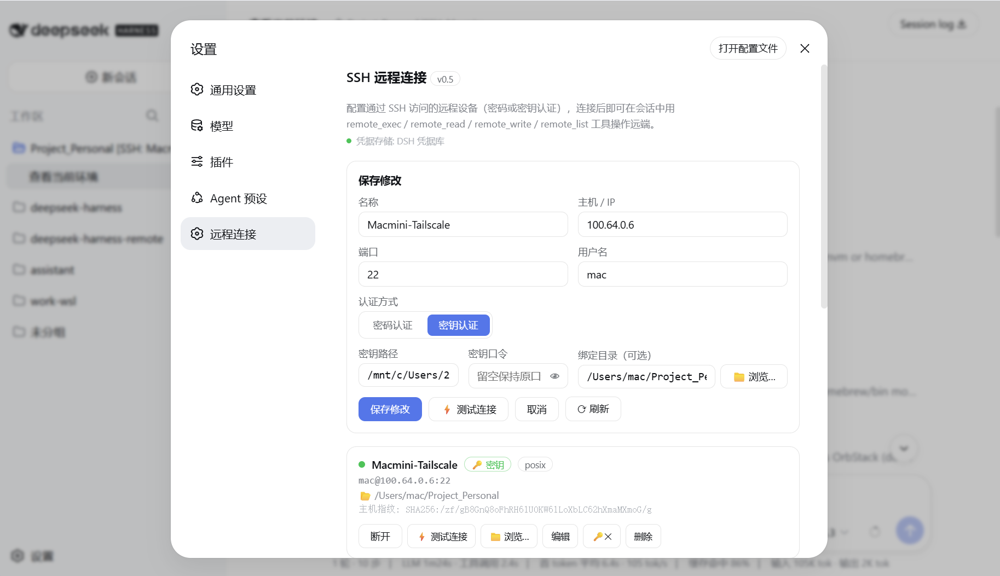
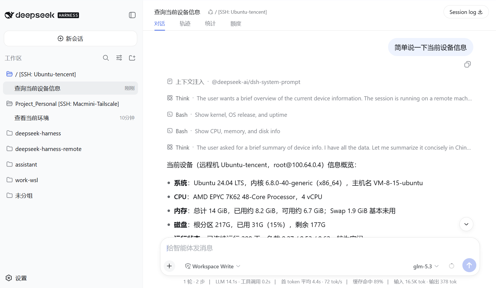

<h1 align="center">DeepSeek Harness Remote Dev</h1>

  <strong>把远程服务器的目录变成 DeepSeek Harness 工作区，像本地一样开发</strong> 
  SSH 直连：浏览、编辑、执行命令、跑测试都发生在远端；远程机器零安装。

  
  
  

  <a href="README.en.md">English</a> · 简体中文 ·
  <a href="#安装">安装</a> ·
  <a href="#三步上手">三步上手</a> ·
  <a href="#远程工作区">远程工作区</a> ·
  <a href="#常见问题">常见问题</a>

  

  

## 这是什么

DeepSeek Harness 的 **SSH 远程开发插件**。连上任意一台能 SSH 的机器，把它上面的目录直接添加成工作区——在这个工作区里新建会话后，`read` / `write` / `edit` / `glob` / `grep` / `bash` 全部作用在**那台机器的那个目录**里。

体验等同于 VS Code Remote Development：界面和模型跑在本机，文件和命令跑在远端。

远程机器**不需要装任何东西**，只要有 SSH Server 和一个能登录的账户。

## 安装

### 方式一：一条命令（推荐）

~~~sh
npx dsh-remote-dev@latest setup
~~~

默认装进 `web` profile；装到别的 profile 加 `--profile headless`。

安装器会准备 profile 目录、写好 pnpm 构建策略、执行安装、登记插件，最后校验是否真的生效。它是幂等的——安装失败后重跑一次就能修复。

### 方式二：用 dsh 命令安装

先在 `~/.dsh/profiles/web/pnpm-workspace.yaml` 里加两行：

~~~yaml
allowBuilds:
  ssh2: false
  cpu-features: false
~~~

再照常安装：

~~~sh
pnpm dsh plugin --profile web add dsh-remote-dev
# 已把 dsh 装成全局命令时：
dsh plugin --profile web add dsh-remote-dev
~~~

**这两行是干什么的？** 本插件依赖 `ssh2`，它带两个**可选**的原生编译脚本（自身的 `install`，以及可选依赖 `cpu-features` 的 node-gyp）。pnpm 11 遇到任何未表态的构建脚本都会让整次安装失败（`ERR_PNPM_IGNORED_BUILDS`）。而这两个构建本来就不需要——ssh2 是纯 JavaScript 实现，没有原生加速时自动回退到 Node 自带 crypto——所以明确拒绝即可，顺带免去本机的 C++ 编译环境。方式一做的就是这件事。

> 确实想编译原生加速：`npx dsh-remote-dev@latest setup --allow-native`（需要 C++ 工具链）。

## 三步上手

1. 启动 DeepSeek Harness（`dsh --profile web`），打开 **设置 → 远程连接**，填写主机、端口、用户名和认证方式，点 **测试连接** 后保存。
2. 在左侧工作区栏点 **添加工作区 → 远程机器**，选中机器，浏览到目标目录并确认。
3. 目录会作为工作区出现在侧边栏（例如 `app [SSH: buildbox]`），直接在它下面新建会话开始对话。

## 远程工作区

这是本插件的主要用法。远程工作区下的每个会话：

- `read` / `write` / `edit` / `glob` / `grep` 通过 SFTP 操作远程文件；
- `bash` 通过 SSH 在远程目录里执行命令；
- 相对路径以远程目录为基准，`{{cwd}}` 也显示远程路径，本机路径不会泄漏给模型；
- persona、AGENTS.md、skills、todo、plan 模式、子 Agent 等能力**全部保留**——远程预设从你的默认预设派生，而不是只剩几个工具；
- 重新打开旧会话仍然回到同一个远程环境。

本地工作区完全不受影响。

## 能力一览

| 能力 | 说明 |
| --- | --- |
| 远程工作区 | 远程目录即工作区，会话内文件与命令全部在远端 |
| 连接管理界面 | 设置页添加、测试、编辑、连接、浏览远程机器 |
| 认证方式 | 密码、私钥、私钥口令；首次连接固定主机指纹 |
| 目录浏览 | 内置 SFTP 浏览器，支持面包屑与键盘操作 |
| 平台支持 | Linux、macOS、WSL、Windows SSH 服务器 |

只想临时跑几条远程命令、不建工作区时，可以让模型直接调用这些工具：

| 工具 | 用途 |
| --- | --- |
| `remote_status` | 查看连接配置、状态、平台和最近错误 |
| `remote_connect` / `remote_disconnect` | 连接或断开一台机器 |
| `remote_exec` | 通过 SSH 执行命令 |
| `remote_read` / `remote_write` | 通过 SFTP 读写 UTF-8 文本 |
| `remote_list` | 通过 SFTP 浏览远程目录 |

## 常见问题

### 安装报错 `[ERR_PNPM_IGNORED_BUILDS] Ignored build scripts: cpu-features@0.0.10, ssh2@1.17.0`

pnpm 11 拒绝在你没表态的情况下跳过依赖的构建脚本，并以**失败**退出；`dsh` 因此不会把插件登记进 `dsh.profile.bundles`——包下载了，但插件不会加载。

跑一次安装器即可修好（它会把 pnpm 留下的待决占位符改成明确的 `false`，重新安装并登记）：

~~~sh
npx dsh-remote-dev@latest setup
~~~

或手动把 `~/.dsh/profiles/web/pnpm-workspace.yaml` 中 `allowBuilds` 下的两项改成 `false`，再重新执行安装命令。

### 装了这个插件后，装**别的**插件也报同样的错

同一个原因：pnpm 每次安装都会重新评估整个 profile 的依赖图，只要 `ssh2` 还在图里、又没表态，就会一直失败。按上面写好 `allowBuilds` 之后，该 profile 里所有插件都会恢复正常。

### 插件装了，但设置里没有「远程连接」

检查 `~/.dsh/profiles/<名称>/package.json` 的 `dsh.profile.bundles` 是否包含 `dsh-remote-dev`。没有就是上面那个失败留下的半成品状态，重跑安装器即可。

### 其他排查

~~~sh
npx dsh-remote-dev@latest setup --dry-run   # 只看将要做的修改，不执行
npx dsh-remote-dev@latest setup --help      # 全部选项
~~~

## 安全边界

- 首次连接记录并校验 SSH 主机指纹，不匹配时直接失败；
- 密码与私钥口令交给 DeepSeek Harness 凭据库保存，浏览器端不回显；
- 远程命令拥有该 SSH 账户本身的权限；
- 绑定目录是工作区语义，**不是**操作系统沙箱；
- 高风险任务请使用专用账户、容器或虚拟机。

## 本地开发

~~~sh
npm ci
npm run test:offline     # 不需要 SSH 的测试
npm run check            # 语法检查
npm run package:check    # 打包并在干净环境安装验证
~~~

把当前源码装进 Web profile：

~~~sh
./scripts/install.sh     # 等价于 setup --package ./packages/remote-ssh
~~~

## 更多

- [远程开发设计](docs/remote-development-design.md)
- [发布指南](docs/PUBLISHING.md)
- [维护交接文档](docs/HANDOVER.md)
- [变更日志](CHANGELOG.md)
- [MIT License](LICENSE)

本项目为社区维护插件，与 DeepSeek AI 官方无关。
